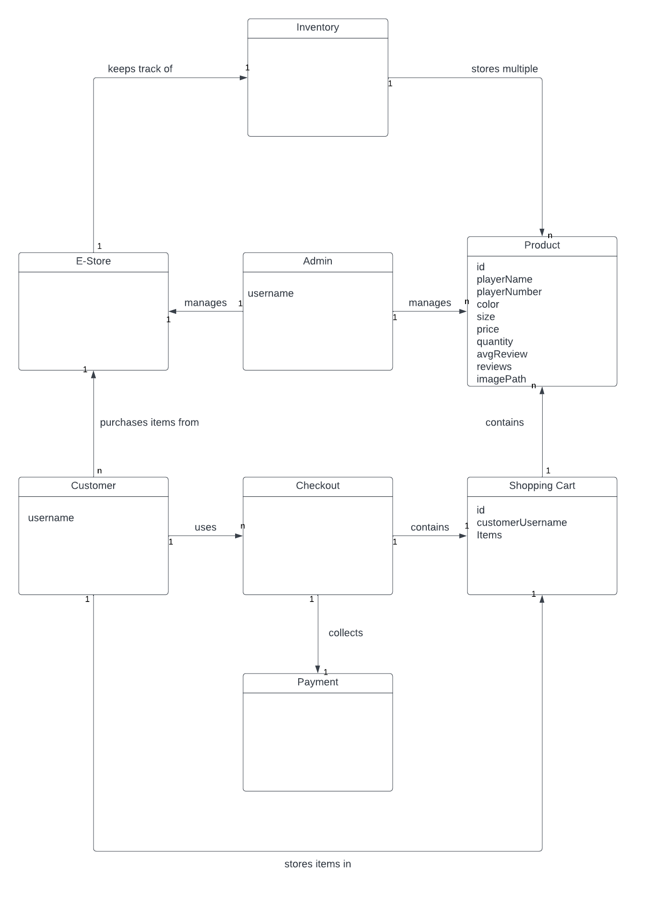
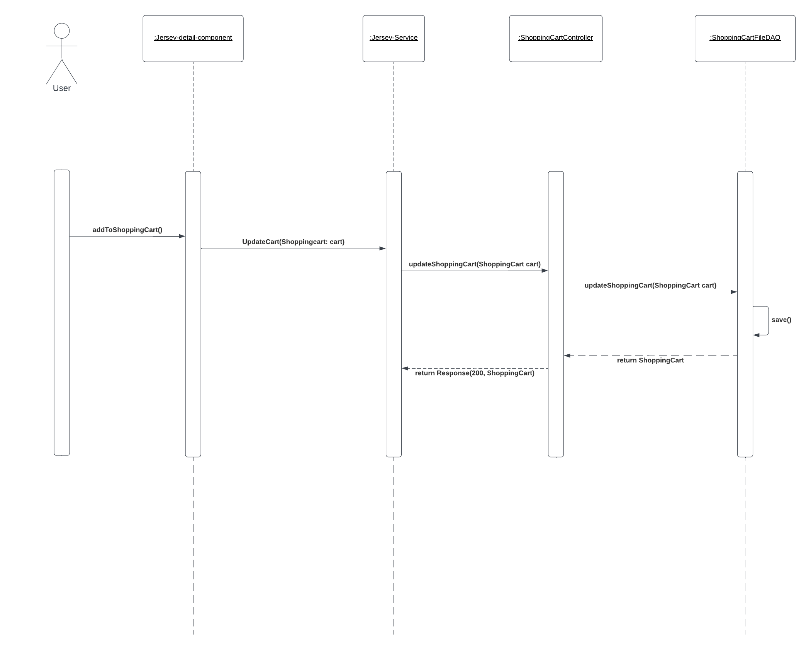
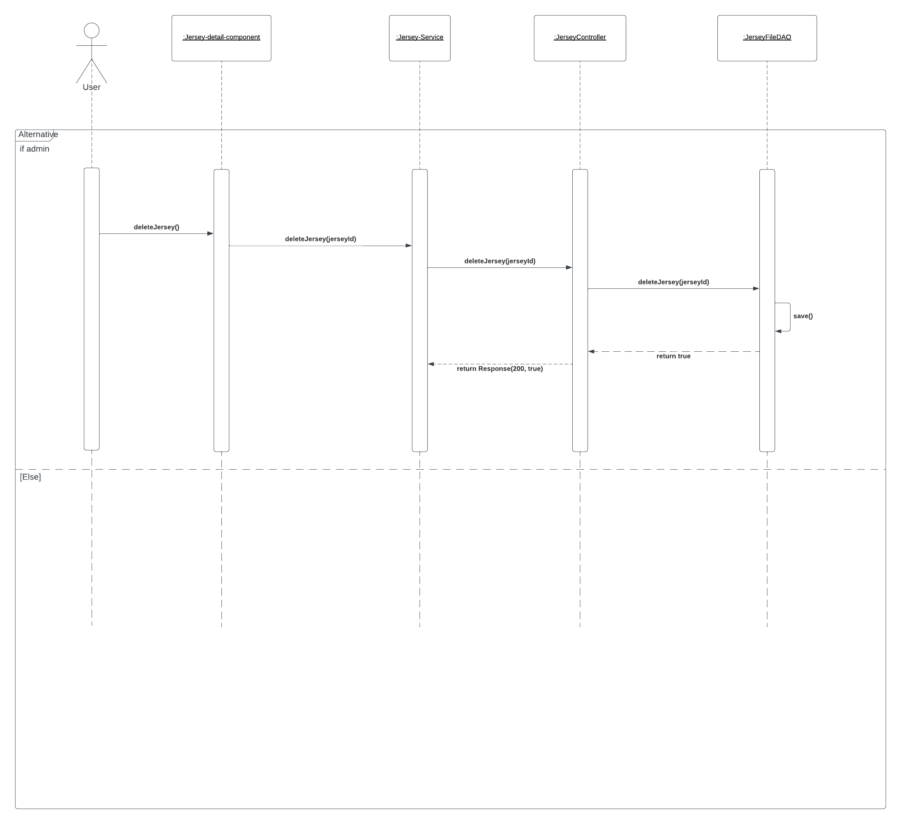
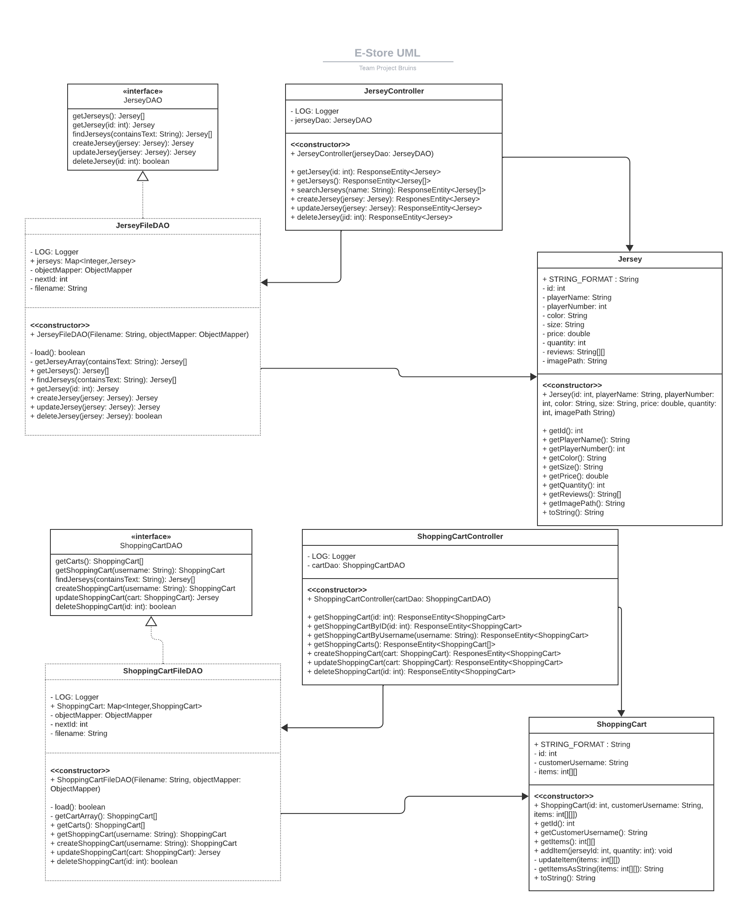
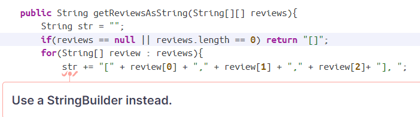
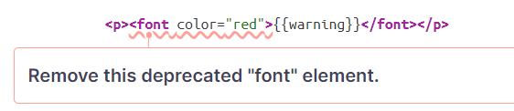
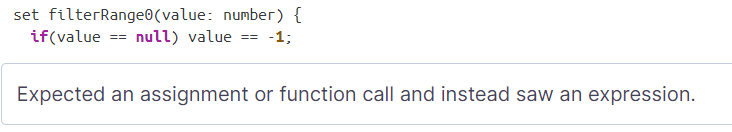
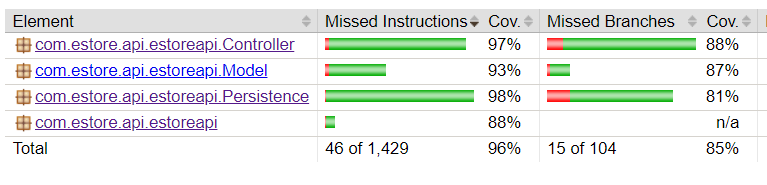
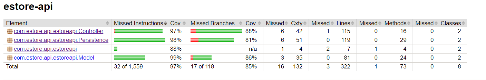

# PROJECT Design Documentation

## Team Information
* Team name: Bruins
* Team members
  * Sairus Seng
  * Alex Rogoff
  * Wesley Foster
  * Zorin Makabenta

## Executive Summary

We are creating an online store where customers can select from a variety of NHL jerseys to into their shopping cart to purchase. The owner of the store will be able to log in and manage the store's inventory.

### Purpose
This project aims to provide a web store that can be used by customers to purchase jerseys and managed by the owner to control the store's inventory. The most important user groups are the customer and the owner. The customer wants the ability to view a selection of jerseys, search through jerseys with specific filters, and be able to purchase the jerseys that they want. The owner wants to manage the store's inventory, with options to create, delete, or update the jersey selection.

### Glossary and Acronyms

| Term | Definition   |
|------|--------------|
| SPA  | Single Page  |
| CRUD | Create, Read,|
|      |Update, Delete|
| MVP  |Minimum Viable|
|      |Product       |
| DAO  |Data Access   |
|      |Object        |

## Requirements

This section describes the features of the application.

### Definition of MVP
The MVP should have minimal authentication for customer/owner login and logout. This would simply require a username.
For customer functionality, the customer should be able to see a list of products, search for a product with filters,
add/remove an item from their shopping cart, and be able to edit the items in their shopping cart, and checkout with the items in their cart. The product will also have an inventory management where the owner or admin will be able to add, remove, and edit data in the inventory. For data persistence, the system will store data within JSON files, specifically a cart (also used to represent a user) and jersey file. This will be updated in user actions such that the next user
will see changes made by the previous user in the data.

### MVP Features
Top Level Epics: Inventory Management, Shopping Cart, Admin Functionality, User Shopping Cart, Checkout.

### Enhancements
Our enhancement for this project is a review system for the jersey. Reviews are an attribute that is attached to a specific jersey. Any logged-in user may leave a review on a jersey. They can select a rating out of 5 and leave a comment about a jersey. Anybody can click on a jersey and see the reviews and the average rating will be displayed on the jersey as well. Reviews are able to be deleted by their creator or the admin.

## Application Domain

This section describes the application domain.

The e-store will support two types of users; admin and customers. Customers will be able to view the estore inventory, save items in their shopping cart to purchase later, and search through the inventory for specific jerseys. Admins can manage the inventory, which includes adding and removing products from the store. The customers will be able to interact with the system through the UI, there will be a navigation bar that allows them to hop between viewing the jerseys and viewing their shopping cart. Our backend consists of a controller, model, and persistence components. The controller handles requests to the server. The model handles the backend logic which includes the object classes for our jerseys. The persistence handles keeping our data up-to-date and updating it based on the CRUD methods that are received from the Controller.

## Architecture and Design

This section describes the application architecture.

### Summary

The following Tiers/Layers model shows a high-level view of the web app's architecture. 

The web application is built using the Model–View–ViewModel (MVVM) architecture pattern. 

The Model stores the application data objects including any functionality to provide persistance. 

The View is the client-side SPA built with Angular utilizing HTML, CSS, and TypeScript. The ViewModel provides RESTful APIs to the client (View) as well as any logic required to manipulate the data objects from the Model.

Both the ViewModel and Model are built using Java and Spring Framework. Details of the components within these tiers are supplied below.

### Overview of User Interface

This section describes the web interface flow; this is how the user views and interacts with the web application.

### View Tier

 When the user first opens the website, they will appear at the Login Component of our Angular UI. This component is responsible for logging in the user by taking in user input. The component works with a Login Service, which handles the communication between the client and server of storing logged-in users and new users in the database, as well as keeping track of who is currently logged in. Once the user inputs their username into the Login Component, they are routed to the Jerseys Component.
 
 The Jerseys Component is the representation of all Jerseys currently in stock. When the UI loads, the component will get all the Jerseys from the server and display them on the UI. A search bar and filters are provided for the user to sort through the Jerseys. From the Jerseys Component, a user can click on any of the Jerseys to view their details. Doing this will bring the user to a Jersey Detail Component.
 
 The Jersey Detail Component will display information about the Jersey and give the user the option to go back to the Jerseys Component or to add the Jersey to their shopping cart with the click of a button. Should they choose to add to the cart, they will be prompted to input a quantity for how much of that Jersey they would like to put in the cart. The quantity is checked to be sure it is valid and does not exceed the quantity in stock. See the first sequence diagram at the bottom for a detailed view. After this, the user can view their cart by clicking the shopping cart icon in the top right. This will route them to the Cart Component. 
 
 This component is only available to logged-in users and once they are logged in the cart will populate with Jerseys that are in their cart. This is stored in the server, so if a user has Jerseys in their cart and logs out, they will still be there once they log back in. On the Cart Component, the Jerseys are displayed similarly to the Jerseys Component, and on the right, there will be a form for the user to properly checkout.
 
 After hitting the Checkout button, the user is taken to the Receipt Component, which is used to display all the information from the purchase they just made. The component will just show all the Jerseys that were purchased and the total price of all of them. The store's Jersey stock is changed after the user checks out.
 
 If the user that logs in is the admin, the UI will appear differently for them. The biggest difference is the admin having access to the Admin Dashboard Component, which they may access after they log in. This page will display the names of the current Jerseys in the store's inventory, even if they are out of stock. At the bottom of the component is a form that the admin can fill out to add a new Jersey to their stock, all the information must be filled in and it is validated. Submitting the form will add the new Jersey to the store immediately for customers to purchase. The admin will also see the option to delete Jerseys from the component, next to their name. Clicking the delete button will prompt the admin with a confirmation before deleting the Jersey from the inventory. 
 
 The admin can also click on the Jersey names to get routed to their respective Jersey Detail Component. The view of this component is different for the admin. The admin is able to edit the values of the Jersey from here and must click the Save button for the changes to go through. The admin can also delete the Jersey from this component as well. See the second sequence diagram below. Both actions will prompt the admin with a confirmation. The admin cannot view the Cart Component and does not have a Shopping Cart stored for them in the server. 

### ViewModel Tier

The ViewModel Tier consists of two Java classes. The Jersey Controller and Shopping Cart Controller. These controller classes handle requests so that the View can get information from the Model without directly sending requests to it. When a request is sent to the Jersey Controller, it will determine what kind of request it is (GET, POST, PUT, DELETE) and will call on the JerseyDAO. It does this so that the effects of the request is consistence with what the server is actually storing. For example, if there is a GET request for a Jersey with ID 1, then the Jersey Controller uses the JerseyDAO to check that a Jersey with ID 1 actually exists in the database. The JerseyDAO will let the Jersey Controller know if the Jersey exists or not, and that will affect the response sent back by the Jersey Controller. In short, the Jersey Controller is responsible for receiving requests and correctly identifying the request to make the correct calls to JerseyDAO to fulfill it. It is also responsible for providing a response back depending on the outcome of the request. The Shopping Cart Controller has the same responsibilities, except it deals with the shopping cart data instead of Jersey data.

### Model Tier

The model tier controls the logic to manage data and CRUD operations.
We have 3 classes; Jersey, ShoppingCart, and Reviews. Each has its own JSON file that stores data of an instance of each class.
For each of these classes, there is a respective FileDAO Class. This handles converting the information in the class into JSON for the JSON file.
For each of these classes, there is a respective Controller Class that has a FileDAO dependency injected into it. This handles HTTP requests 
coming to the server and properly corresponding it to a CRUD method in the FileDAO Class.

For example: If a client sent a GET request for a specific jersey to our server, it would follow this path:
HTTP is received by JerseyController
the getJersey(id: int) method is called
this method calls the JerseyFileDAO's getJersey(id: int) method (the FileDAO is injected in the constructor)
The JerseyFileDAO will load the data from the jersey.json file and find the jersey with the matching id
then it will return a new Jersey object with that data in it. This is passed back up to the controller, which returns
the jersey as a Response Object with a 200:OK code

If the JerseyFileDAO fails to find the jersey, it will return null, in which the JerseyController will return a 404:NOT FOUND code.

## OO Design Principles

Dependency Inversion is used throughout the model tier to manage the Controller classes for each object. Each controller class has a FileDAO class injected into it to manage HTTP requests working with the data storage. In our , the injections can be seen there along with how they interact with everything else. The ViewModel tier also has this design principle in it. Most components have Services injected into them to help with managing data between the front and backends, as well as communicating info and changes between each other. 

Controllers are used throughout the project to manage the flow of data easier and have it all in one place. This is done to adhere to GRASP. In our backend, the Controller classes for each object connect all other objects and DAOs to handle HTTP requests all in one place. The front end in Angular also has something like this through Services. Services for Jerseys and Shopping carts are used to send CRUD HTTP requests to the backend. They are all in one place and are used widely throughout the frontend to keep information about Jerseys consistent and all changes to Jerseys or Shopping carts will flow through their Service and to the backend.

Information Expert: 
In our backend, the Jersey/ShoppingCart class stores all of its attributes such as ID, playerName, number, color, size, and quantity. The methods of this class are getters and setters that are necessary for other classes to use. The Jersey/ShoppingCartFileDAO class stores a map of Jerseys and converts them to a JSON format to a file. These class methods are all CRUD operations for that file. It will also load and save to the file after every operation and when the application is started. The Jersey/ShoppingCartController class just has an instance of JerseyFileDAO injected into it, it uses it to manage HTTP requests and update the data file correctly. It has methods to handle requests such as GET, POST, PUT, and DELETE, which correspond to the CRUD methods of the JerseyFileDAO. On our front end, each component also has its own data, usually an array or jersey and carts. Each component uses its data to perform functions for its own use. Any info used between components is handled with a service. 

Single Responsibility:
In our project, single responsibility is present in our Controller class, and DAO classes. Each controller is solely responsible for handling HTTP requests. They do not manage any of the data. The DAO class's only responsibility is to handle data. The class provides CRUD functions that directly affect the database. In the View Tier, services are used for functionality and also have single responsibilities. The Jersey and Shopping Cart services both respectively work with the Controllers to communicate requests between the View and ViewModel. The Validator Service is only responsible for validating the user input of a Jersey's fields. The Login Service is responsible for taking in the user login and storing it for other components to reference. 

## Static Code Analysis/Future Design Improvements

The analysis had a few issues with our Jersey.java Model class. The first issue was with the constructor. It takes 10 parameters, which are for all the attributes of a Jersey. It recommends to split up the constructor into smaller classes/functions. We are not sure if that is possible since this is a class constructor and all of the attributes are necessary for creating Jersey objects.
The next issue was with the Jersey's getReviewsAsString function. A screenshot is shown below of how we currently have the function implemented. It uses a loop to concatenate the string before returning it. The analysis says that this is bad for performance and recommends a string builder. We do agree with that improvement since reviews have the potential to get long if there are a lot of reviews. Therefore using a string builder to convert the reviews into a clean string would be good for performance in the future.

The next spot in our code that was flagged was in the UI. In general, a lot of this was issues with the CSS. For example, we did not use any alt tags for any of our images. This hurts the estore's accessibility, so we would follow the recommendation to add these tags to the images. The other issues have to do with redundant or obsolete CSS. We should definitely go through the CSS and clean up some of the redundant tags for the sake of readability and reliability in the future. Below is a screenshot of a font tag being used to color some text on our UI. The analysis flagged this since the tag is deprecated. It would be good if we removed the tag and used CSS to color the text instead since it would be more maintainable. 

The last spot was also in the UI in the Jerseys Component. In our functions that are used to search the Jersey stock, we tried to handle the edge case of a null value being input by catching it with an if statement and setting the value to instead be -1. We did this three separate times in the code and missed a type that has led to a current bug. During our manual testing, we did not catch this bug, but since we are aware of it now it would be best to fix it now so that the code is more bug-free and maintainable.

Some aspects of the project were not as prioritized due to the short time the team had to develop the estore. These portions largely include quality-of-life issues that are relatively prominent while using the website. The first and most glaring issue that the project contains is the lack of accessibility and visual clutter that the website is plagued by. Improving the visuals and providing a better structure for things like the admin pages or search tools will not only improve the usability of the estore but also increase the efficiency and learnability for a user increase. The admin could also become more proficient in their use of the site if they had the full capability of a normal user, meaning that they could test their cart to ensure that problems do not occur. Other less glaring improvements include making users register instead of creating an account when they log in to prevent spelling errors from causing a new account to be made and improvements to our automated stock management system so that users don't lose out on items in their cart if another user checks them out. A back-end improvement that should be made is increasing the single responsibility of some aspects of the project, for example, the jersey controller should not be sorting through the jerseys while the JerseyFileDAO already partially does this and would be a more appropriate file for doing this.

## Testing

### Acceptance Testing

All of our user stories have passed so far. Most of them are Developer stories for the CRUD methods of our DAO objects.

As of sprint 2, we have a total of 17 user stories and 40 acceptance criteria. 17/17 user stories have been tested and 17/17 stories passed. 40/40 acceptance criteria have been tested and 40/40 acceptance criteria have passed. There have been no concerns or major issues found as a result of the acceptance testing. 

As of sprint 4, we have a total of 33 user stories and 67 acceptance criteria. 33/33 user stories have been tested and 33/33 stories passed. 67/67 acceptance criteria have been tested and 67/67 acceptance criteria have passed. There are no concerns or major issues found as a result of the acceptance testing. 

### Unit Testing and Code Coverage

For our unit tests, we wanted to test each of our CRUD operations for each of our DAOs. These needed to work properly so that the front end could properly get data from the server. We tested for cases where our controllers returned the DAO with the proper response code, as well as any errors that occurred and those response codes as well. After writing tests for most of our code, we checked our code coverage to write more tests so that there would be over 90% coverage. Since this project is fairly small, we thought it was important for over 90% of the code to be covered. The only anomaly in our coverage is in the JerseyController tests. There's a line in the CreateJersey function showing that we did not test the response for CreateJersey, but it appears that we have it in our tests. 

